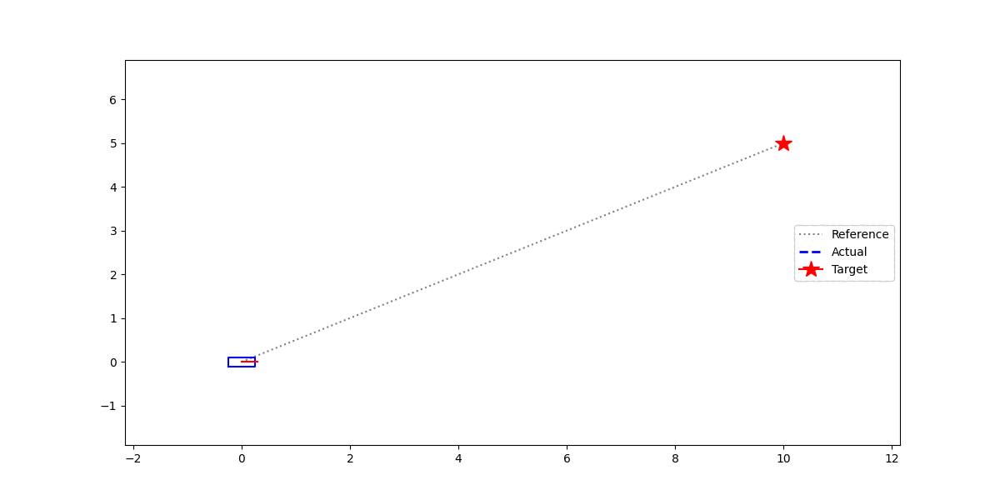
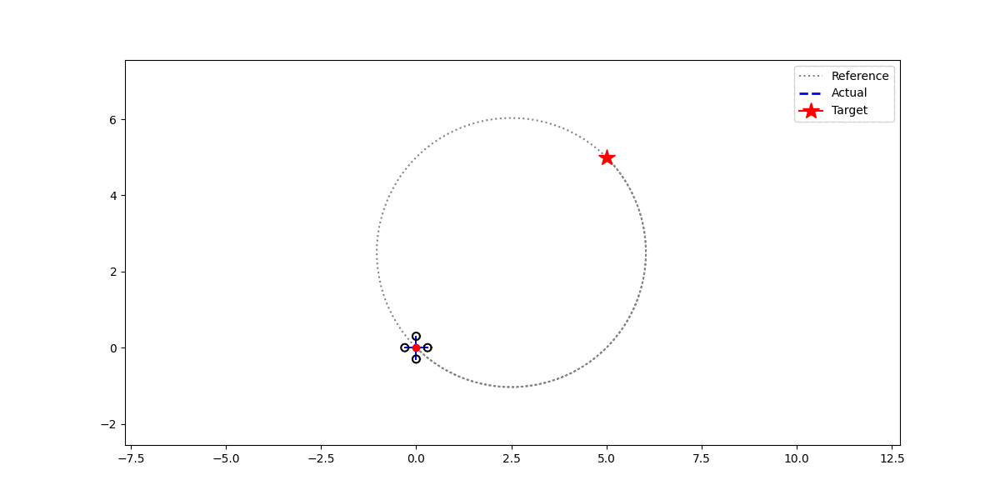

# MPC using Acados

## Overview
This project implements a generic Model Predictive Control (MPC) framework using Acados. Define your robot model in Python, generate optimized C code, and run real-time MPC in C++ without recompilation.

## Dependencies
- Acados
- CMake
- Python 3 with CasADi, NumPy
- Matplotlib C++ (for plotting)

## Workflow
1. Define robot model in Python (`python/your_model.py`)
2. Generate Acados C code (`python generate_your_model.py`)
3. Create JSON config (`configs/your_model.json`)
4. Run generic MPC controller with your config

## Building the Project
To build the project, follow these steps:

1. **Clone the repository**:
    ```sh
    git clone https://github.com/SokhengDin/NMPC-ACADOS-CPP.git
    cd NMPC-ACADOS-CPP
    ```

2. **Create a build directory and navigate to it**:
    ```sh
    mkdir build
    cd build
    ```

3. **Run CMake to configure the project**:
    ```sh
    cmake ..
    ```

4. **Build the project**:
    ```sh
    make
    ```

## Running the Solver

1. Generate Acados code for your model:
```sh
cd python
python generate_differential_drive.py
python generate_bicycle.py
```

2. Build the project:
```sh
mkdir build && cd build
cmake ..
make
```

3. Run MPC controller with model config:
```sh
cd build
DYLD_LIBRARY_PATH=. ./mpc_controller ../configs/differential_drive.json
DYLD_LIBRARY_PATH=. ./mpc_controller ../configs/bicycle.json
```

Plots will be saved to `plots/` directory with model name suffix.

## Implemented Models

### Bicycle Model

The kinematic bicycle model is commonly used for car-like robots and autonomous vehicles. It captures the nonholonomic constraints of wheeled vehicles.



#### State Vector
```math
x = \begin{bmatrix} x \\ y \\ \theta \\ v \end{bmatrix}
```

where:
- $x, y$ are the position coordinates
- $\theta$ is the heading angle
- $v$ is the linear velocity

#### Control Input Vector
```math
u = \begin{bmatrix} a \\ \delta \end{bmatrix}
```

where:
- $a$ is the acceleration
- $\delta$ is the steering angle

#### Dynamics
```math
\begin{align}
\dot{x} &= v \cos(\theta) \\
\dot{y} &= v \sin(\theta) \\
\dot{\theta} &= \frac{v}{L} \tan(\delta) \\
\dot{v} &= a
\end{align}
```

where $L = 2.5$ m is the wheelbase (distance between front and rear axles).

### Quadrotor Model

The quadrotor model represents a 3D quadcopter with planar dynamics for trajectory tracking.



#### State Vector
```math
x = \begin{bmatrix} x \\ y \\ z \\ v_x \\ v_y \\ v_z \\ \phi \\ \theta \\ \psi \\ p \\ q \\ r \end{bmatrix}
```

where:
- $x, y, z$ are the position coordinates
- $v_x, v_y, v_z$ are the linear velocities
- $\phi, \theta, \psi$ are the roll, pitch, and yaw angles (Euler angles)
- $p, q, r$ are the body-frame angular velocities (roll rate, pitch rate, yaw rate)

#### Control Input Vector
```math
u = \begin{bmatrix} F \\ \tau_\phi \\ \tau_\theta \\ \tau_\psi \end{bmatrix}
```

where:
- $F$ is the total thrust force
- $\tau_\phi, \tau_\theta, \tau_\psi$ are the torques around roll, pitch, and yaw axes

#### Dynamics

**Translational dynamics:**
```math
\begin{align}
\dot{x} &= v_x \\
\dot{y} &= v_y \\
\dot{z} &= v_z \\
\dot{v}_x &= \frac{F}{m}(\sin(\psi)\sin(\phi) + \cos(\psi)\sin(\theta)\cos(\phi)) \\
\dot{v}_y &= \frac{F}{m}(-\cos(\psi)\sin(\phi) + \sin(\psi)\sin(\theta)\cos(\phi)) \\
\dot{v}_z &= \frac{F}{m}\cos(\theta)\cos(\phi) - g
\end{align}
```

**Euler angle kinematics:**
```math
\begin{align}
\dot{\phi} &= p + \sin(\phi)\tan(\theta)q + \cos(\phi)\tan(\theta)r \\
\dot{\theta} &= \cos(\phi)q - \sin(\phi)r \\
\dot{\psi} &= \frac{\sin(\phi)}{\cos(\theta)}q + \frac{\cos(\phi)}{\cos(\theta)}r
\end{align}
```

**Angular dynamics (with gyroscopic coupling):**
```math
\begin{align}
\dot{p} &= \frac{\tau_\phi}{I_{xx}} + \frac{I_{yy} - I_{zz}}{I_{xx}}qr \\
\dot{q} &= \frac{\tau_\theta}{I_{yy}} + \frac{I_{zz} - I_{xx}}{I_{yy}}pr \\
\dot{r} &= \frac{\tau_\psi}{I_{zz}} + \frac{I_{xx} - I_{yy}}{I_{zz}}pq
\end{align}
```

where:
- $m = 1.0$ kg is the mass of the quadrotor
- $g = 9.81$ m/s² is the gravitational acceleration
- $I_{xx} = 0.01$ kg·m², $I_{yy} = 0.01$ kg·m², $I_{zz} = 0.02$ kg·m² are the moments of inertia

## Model Predictive Control (MPC) Cost Function

The MPC cost function in this implementation is formulated as a nonlinear least-squares problem. The cost function penalizes the deviation of the predicted states and controls from their reference values over a prediction horizon.

Let $x_k \in \mathbb{R}^{n_x}$ be the state vector and $u_k \in \mathbb{R}^{n_u}$ be the control input vector at time step $k$. The reference state and control trajectories are denoted as $x^{ref}_k$ and $u^{ref}_k$, respectively.

The cost function is defined as:

```math
J = \sum_{k=0}^{N-1} \left\| \begin{bmatrix} x_k - x^{ref}_k \\ u_k - u^{ref}_k \\ u_k - u_{k-1} \end{bmatrix} \right\|^2_W + \left\| x_N - x^{ref}_N \right\|^2_{W_e}
```

where:
- $N$ is the prediction horizon length
- $W$ is the weight matrix for the stage cost, defined as a block-diagonal matrix:
  
```math
W = \begin{bmatrix} Q & 0 & 0 \\ 0 & R & 0 \\ 0 & 0 & R_{rate} \end{bmatrix}
```
  
  - $Q \in \mathbb{R}^{n_x \times n_x}$ is the weight matrix for the state deviation
  - $R \in \mathbb{R}^{n_u \times n_u}$ is the weight matrix for the control input deviation
  - $R_{rate} \in \mathbb{R}^{n_u \times n_u}$ is the weight matrix for the control input rate deviation
- $W_e$ is the weight matrix for the terminal cost, which penalizes the deviation of the final state from the reference state

The cost function minimizes the weighted sum of the squared deviations of the predicted states and controls from their reference values, as well as the control input rate deviations. The terminal cost ensures that the final state reaches the desired reference state.

## Sequential Quadratic Programming (SQP) Solver

The MPC problem is solved using the Sequential Quadratic Programming (SQP) method, which iteratively solves a sequence of quadratic programming (QP) subproblems to find the optimal control inputs.

At each iteration $i$, the SQP method linearizes the nonlinear system dynamics and cost function around the current estimate of the optimal solution $(x^{(i)}, u^{(i)})$. The resulting QP subproblem is:

```math
\begin{align}
\min_{d_x, d_u} \quad & \frac{1}{2} \begin{bmatrix} d_x \\ d_u \end{bmatrix}^T H^{(i)} \begin{bmatrix} d_x \\ d_u \end{bmatrix} + \nabla J(x^{(i)}, u^{(i)})^T \begin{bmatrix} d_x \\ d_u \end{bmatrix} \\
\text{s.t.} \quad & x_{k+1} = f(x_k, u_k) + \nabla f(x_k^{(i)}, u_k^{(i)}) \begin{bmatrix} d_{x,k} \\ d_{u,k} \end{bmatrix} \\
& x_0 = \bar{x}_0 \\
& x_k \in \mathcal{X}, \quad u_k \in \mathcal{U}
\end{align}
```

where:
- $d_x$ and $d_u$ are the search directions for the states and controls, respectively
- $H^{(i)}$ is the Hessian matrix of the Lagrangian function at iteration $i$
- $\nabla J(x^{(i)}, u^{(i)})$ is the gradient of the cost function at iteration $i$
- $f(x_k, u_k)$ represents the nonlinear system dynamics
- $\nabla f(x_k^{(i)}, u_k^{(i)})$ is the Jacobian of the system dynamics at iteration $i$
- $\bar{x}_0$ is the initial state
- $\mathcal{X}$ and $\mathcal{U}$ are the feasible sets for the states and controls, respectively

The QP subproblem is solved to obtain the search directions $(d_x^*, d_u^*)$, which are used to update the current estimate of the optimal solution:

```math
\begin{align}
x^{(i+1)} &= x^{(i)} + \alpha_x d_x^* \\
u^{(i+1)} &= u^{(i)} + \alpha_u d_u^*
\end{align}
```

where $\alpha_x$ and $\alpha_u$ are the step sizes determined by a line search procedure to ensure sufficient decrease in the cost function.

The SQP iterations continue until a convergence criterion is met, such as the norm of the search directions falling below a specified tolerance or reaching a maximum number of iterations.

The ACADOS solver used in this implementation employs a real-time iteration (RTI) variant of the SQP method, which allows for efficient and fast solution of the MPC problem in real-time applications.

## Runge-Kutta Method for State Approximation

```math
\begin{align}
k_1 &= f(x_k, u_k) \\
k_2 &= f(x_k + \frac{h}{2} k_1, u_k) \\
k_3 &= f(x_k + \frac{h}{2} k_2, u_k) \\
k_4 &= f(x_k + h k_3, u_k) \\
x_{k+1} &= x_k + \frac{h}{6} (k_1 + 2k_2 + 2k_3 + k_4)
\end{align}
```

The Runge-Kutta method is used to approximate the state evolution of the system given the current state and control input. In this implementation, the fourth-order Runge-Kutta method (RK4) is employed.

Given the current state $x_k$ and control input $u_k$, the next state $x_{k+1}$ is approximated using the above steps, where:
- $f(x_k, u_k)$ represents the system dynamics function
- $h$ is the time step size
- $k_1$, $k_2$, $k_3$, and $k_4$ are the intermediate stages of the RK4 method

The RK4 method provides a higher-order approximation of the state evolution compared to simpler methods like Euler's method. It takes into account the slope of the system dynamics at multiple points within the time step, resulting in a more accurate approximation.

By using the Runge-Kutta method, the MPC algorithm can predict the future states of the system more accurately, leading to improved control performance.
